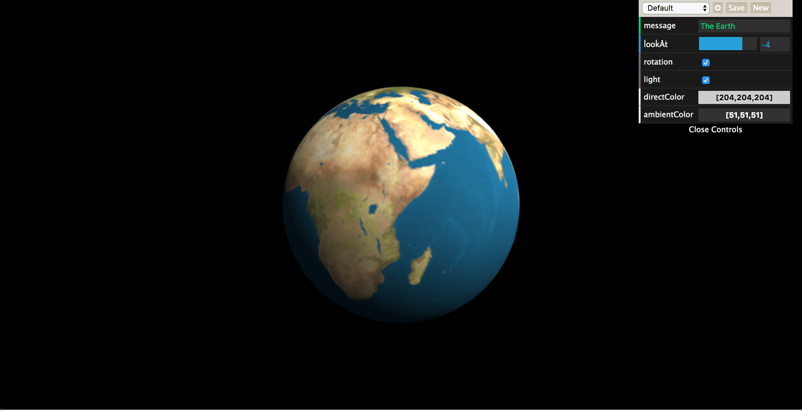

###WebGL地球

####运行：

在本地开启一个服务器访问，比如可以使用 [edp](http://ecomfe.github.io/edp/)

```npm install -g edp```

然后在当前目录运行

```edp webserver start```

####截图



####参考：

<a href="http://www.hiwebgl.com/?p=339">WebGL教程-球体、旋转矩阵</a>


